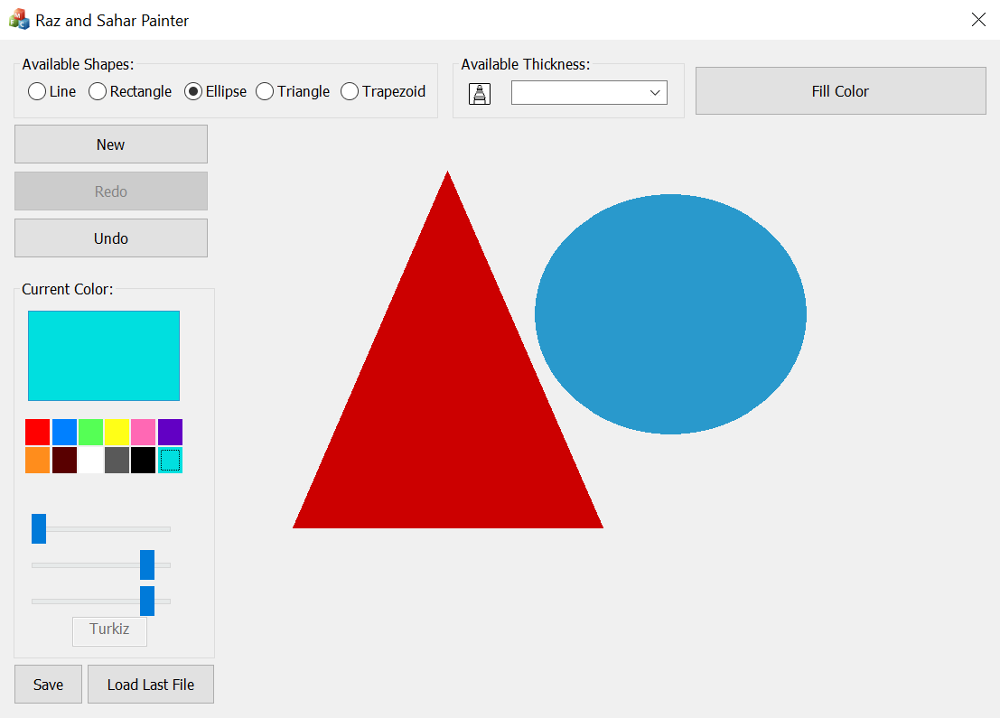

# MFC Painter
## General:
- I made this project with C++ and used MFC, as a part of my B.Sc in Computer Science, in OOP Course.
- The project purpose was to investigate Polymorphism and Inheritence.
- All files are included in ../src folder and may not compile if you will not link the related icons to the dialog.

## The Painter:

### User Interface:

As you can see there are 5 areas in my user interface:
1. Available Shapes:
- In this area you can choose the shape you would like to make, there are five shapes you can choose:
    - Line
    - Rectangle
    - Ellipse
    - Triangle
    - Trapezoid

2. Color Area:
- In this area you can choose the color you would like to paint with, and also you can view the current color by it's name and by it's color, if you'll move the sliders the name will be changed to Unsynced until you'll choose again one of the synced colors.
- You may move the sliders to choose your own RGB color, the rectangle above will change it's color by your choice in the sliders.

3. New / Redo / Undo Area:
- New: This button will clear the stack of the shapes, and will clear the dialog, which means you'll be able to restart drawing shapes.
- Undo: This button will be disabled unless there is a shape on the dialog.
- Redo: This button will be disabled once there are no more shapes to redo.

4. Available Thickness:
- In this area you can choose the thick you want to paint with, one of 3 options:
    - Broken
    - Normal
    - Very Broken

5. Fill Color
- In this area you can change your shape's color by clicking a color, then the button and right click on the relevant shape, to enable fill option you'll have to click on the color you want to use and then click on the button.

## License:
Feel free to use, change and do whatever you want with this code.
